# When Stuck - Problem-Solving Dispatch

## Overview

Different stuck-types need different techniques. This skill helps you quickly identify which problem-solving skill to use.

**Core principle:** Match stuck-symptom to technique.

## Quick Dispatch

```dot
digraph stuck_dispatch {
    rankdir=TB;
    node [shape=box, style=rounded];

    stuck [label="You're Stuck", shape=ellipse, style=filled, fillcolor=lightblue];

    complexity [label="Same thing implemented 5+ ways?\nGrowing special cases?\nExcessive if/else?"];
    innovation [label="Can't find fitting approach?\nConventional solutions inadequate?\nNeed breakthrough?"];
    patterns [label="Same issue in different places?\nFeels familiar across domains?\nReinventing wheels?"];
    assumptions [label="Solution feels forced?\n'This must be done this way'?\nStuck on assumptions?"];
    scale [label="Will this work at production?\nEdge cases unclear?\nUnsure of limits?"];
    bugs [label="Code behaving wrong?\nTest failing?\nUnexpected output?"];

    stuck -> complexity;
    stuck -> innovation;
    stuck -> patterns;
    stuck -> assumptions;
    stuck -> scale;
    stuck -> bugs;

    complexity -> simp [label="yes"];
    innovation -> collision [label="yes"];
    patterns -> meta [label="yes"];
    assumptions -> invert [label="yes"];
    scale -> scale_skill [label="yes"];
    bugs -> debug [label="yes"];

    simp [label="skills/problem-solving/\nsimplification-cascades", shape=box, style="rounded,filled", fillcolor=lightgreen];
    collision [label="skills/problem-solving/\ncollision-zone-thinking", shape=box, style="rounded,filled", fillcolor=lightgreen];
    meta [label="skills/problem-solving/\nmeta-pattern-recognition", shape=box, style="rounded,filled", fillcolor=lightgreen];
    invert [label="skills/problem-solving/\ninversion-exercise", shape=box, style="rounded,filled", fillcolor=lightgreen];
    scale_skill [label="skills/problem-solving/\nscale-game", shape=box, style="rounded,filled", fillcolor=lightgreen];
    debug [label="skills/debugging/\nsystematic-debugging", shape=box, style="rounded,filled", fillcolor=lightyellow];
}
```

## Stuck-Type → Technique

| How You're Stuck | Use This Skill |
|------------------|----------------|
| **Complexity spiraling** - Same thing 5+ ways, growing special cases | skills/problem-solving/simplification-cascades |
| **Need innovation** - Conventional solutions inadequate, can't find fitting approach | skills/problem-solving/collision-zone-thinking |
| **Recurring patterns** - Same issue different places, reinventing wheels | skills/problem-solving/meta-pattern-recognition |
| **Forced by assumptions** - "Must be done this way", can't question premise | skills/problem-solving/inversion-exercise |
| **Scale uncertainty** - Will it work in production? Edge cases unclear? | skills/problem-solving/scale-game |
| **Code broken** - Wrong behavior, test failing, unexpected output | skills/debugging/systematic-debugging |
| **Multiple independent problems** - Can parallelize investigation | skills/collaboration/dispatching-parallel-agents |
| **Root cause unknown** - Symptom clear, cause hidden | skills/debugging/root-cause-tracing |

## Process

1. **Identify stuck-type** - What symptom matches above?
2. **Load that skill** - Read the specific technique
3. **Apply technique** - Follow its process
4. **If still stuck** - Try different technique or combine

## Combining Techniques

Some problems need multiple techniques:

- **Simplification + Meta-pattern**: Find pattern, then simplify all instances
- **Collision + Inversion**: Force metaphor, then invert its assumptions
- **Scale + Simplification**: Extremes reveal what to eliminate

## Remember

- Match symptom to technique
- One technique at a time
- Combine if first doesn't work
- Document what you tried
